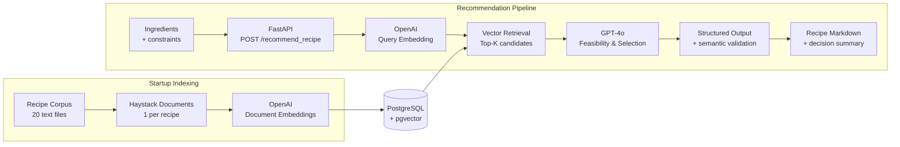

# What's for Dinner

A small RAG application that recommends one recipe from a fixed corpus based on a free-text
description of the ingredients and constraints a user has. Built with FastAPI, Haystack 2.x,
PostgreSQL/pgvector, and GPT-4o.

> Retrieval finds plausible candidate recipes; it does not make the final recommendation
> decision. GPT-4o compares the retrieved candidates against the user's actual ingredients and
> constraints and produces an explainable, structured decision.

## Architecture



**Retrieval generates candidates; it does not make the recommendation.** GPT-4o evaluates
ingredient coverage and user constraints across the retrieved candidates. The resulting
structured decision is then validated by the application to ensure the selected recipe actually
belongs to the retrieved candidate set.

### Project layout

```
src/whats_for_dinner/
  config.py, errors.py, models.py    settings, domain exceptions, Pydantic models
  recipes.py, ingestion.py           recipe loading + deterministic IDs, idempotent ingestion
  retrieval.py, prompts.py           pgvector retrieval, the recommendation prompt
  generation.py, service.py          GPT-4o structured output, orchestration + semantic validation
  main.py                            FastAPI app, component wiring, the one thin route
  *_test.py                          colocated pytest tests, one per module
eval/                                 manually annotated evaluation fixture + runner
```

`data/recipes/` (the 20 supplied recipes) is what the app actually reads; `data.zip` is the
original archive, unused. Flat inside `src/whats_for_dinner/` on purpose - the corpus and
pipeline are small enough that sub-packages would add navigation overhead without benefit.

## Setup

### Prerequisites

- Python 3.12+, [`uv`](https://docs.astral.sh/uv/)
- A Docker-compatible runtime (Docker Desktop, or Colima + the `docker` CLI)
- An OpenAI API key with access to `gpt-4o` and an embedding model

### 1. Start PostgreSQL/pgvector

```bash
docker compose up -d
```

Starts the supplied `ankane/pgvector` image on `localhost:5432`. No other datastore is used.

> No named volume is configured, so `docker compose down` wipes the database (`stop`/`start`
> preserves it). Not an issue in practice - ingestion is idempotent, so the app self-heals on
> next startup.

### 2. Configure environment

```bash
cp .env.example .env   # then set OPENAI_API_KEY
```

| Variable | Purpose | Default |
|---|---|---|
| `OPENAI_API_KEY` | required, never logged/printed | - |
| `OPENAI_CHAT_MODEL` | generation model | `gpt-4o` |
| `OPENAI_EMBEDDING_MODEL` | embedding model | `text-embedding-3-small` |
| `EMBEDDING_DIMENSION` | must match the embedding model's output size | `1536` |
| `DATABASE_URL` | pgvector connection string | matches `docker-compose.yml` |
| `RECIPE_DATA_PATH` | folder of recipe `.txt` files | `data/recipes` |
| `RETRIEVAL_TOP_K` | candidates retrieved before GPT-4o reasoning | `5` |

### 3. Install dependencies

```bash
uv sync
```

Creates `.venv` and installs the pinned dependencies plus a `dev` group.

### 4. Run the app

```bash
uv run uvicorn whats_for_dinner.main:app --reload
```

Ingests recipes on startup, then serves at `http://127.0.0.1:8000`.

## Using the API

```bash
curl -s -X POST http://127.0.0.1:8000/recommend_recipe \
  -H 'Content-Type: application/json' \
  -d '{"text": "I have chicken, broccoli and soy sauce"}'
```

```json
{
  "recipe": "# Quick Chicken Stir-Fry\n\n**Ingredients:**\n\n- 2 chicken breasts, diced\n...",
  "decision": {
    "selected_recipe": "Quick Chicken Stir-Fry",
    "matched_ingredients": ["chicken", "soy sauce"],
    "missing_ingredients": ["mixed vegetables", "garlic"],
    "assumed_pantry_staples": ["vegetable oil"],
    "constraint_conflicts": [],
    "is_reasonable_match": true
  }
}
```

- An explicit exclusion every candidate conflicts with (e.g. "no cheese, I'm dairy-free")
  produces `is_reasonable_match: false` with the conflicting ingredient named.
- Empty/whitespace-only `text` returns `422`.
- The public response only exposes `recipe` (Markdown) and a `DecisionSummary`; internal
  diagnostic fields (`selected_recipe_id`, `decision_reason`) are logged per request rather than
  returned.

## Implementation notes

### Idempotent ingestion

One recipe file becomes one `Document`, with a deterministic ID from `sha256(filename +
normalized_content)`:

- Unchanged recipes are not re-embedded on restart.
- Changed recipes replace their stale version instead of accumulating duplicates.

Verified manually: two consecutive startups against the supplied 20 recipes ingest 20, then 0.

### Structured recommendation

GPT-4o returns strict, schema-constrained JSON, which Pydantic validates for shape. That alone
doesn't guarantee grounding, so the application separately verifies `selected_recipe_id` belongs
to the retrieved candidates, canonicalizes the title from that candidate rather than trusting the
LLM's copy, and raises `GenerationError` if the id is invalid.

```python
class RecommendationDecision(BaseModel):
    selected_recipe_id: str
    selected_recipe_title: str
    matched_ingredients: list[str]
    missing_ingredients: list[str]
    assumed_pantry_staples: list[str]
    constraint_conflicts: list[str]
    decision_reason: str
    is_reasonable_match: bool
    markdown: str
```

### Pantry policy

Allowed staples: salt, pepper, water, cooking oil (common variants - vegetable, olive, canola -
map to the same staple). Everything else the user didn't mention is reported as a genuine
missing ingredient, never silently assumed.

## Design decisions & trade-offs

- **One document per recipe** - recipes are short cohesive units; chunking would separate
  ingredients from the instructions that use them.
- **PostgreSQL/pgvector as the only vector store** - supplied by the challenge;
  `pgvector-haystack` was added explicitly since Haystack 2.12 has no Postgres integration built in.
- **Retrieval is candidate generation, not the final decision** - no hard similarity threshold
  without evaluation evidence; `top_k` is the only retrieval lever.
- **GPT-4o performs the contextual feasibility/selection**, comparing literal user ingredients
  against each candidate's real ingredient list - vector similarity alone can't tell feasibility.
- **Structured output + semantic validation** - the model's JSON is schema-validated, then
  checked that the selected id was actually retrieved, so recommendations are well-formed *and*
  grounded.
- **Quantities remain natural language** - the full request is passed to GPT-4o as-is; no
  unit/measurement normalization subsystem was built.
- **Startup ingestion is appropriate for 20 recipes** - a dedicated indexing job is the scaling
  path (see [Production evolution](#production-evolution)).
- **Sync Haystack pipeline, async FastAPI boundary** - the pinned embedders have no `run_async`,
  so the one blocking call per request is offloaded with `asyncio.to_thread`.

## Limitations

- The 20-recipe corpus is tiny; retrieval quality here doesn't generalize to a larger, noisier
  catalog.
- Ingredient interpretation is GPT-4o's semantic judgment, not a deterministic matcher - there's
  no normalization/ontology layer. Evaluation separately uses case-insensitive set matching
  against manually annotated labels.
- `missing_ingredients` recall is imperfect (~0.6) - the model sometimes under-reports an
  ingredient it considers minor.
- Recommendation generation is not fully deterministic - see
  [Evaluation strategy](#evaluation-strategy) for a concrete example.
- No auth, rate limiting, or centralized observability - intentionally out of scope for a PoC
  (see [Production evolution](#production-evolution)).

## Tests

```bash
uv run pytest
uv run ruff check .
uv run pyright
```

30 tests, with all external OpenAI/DB interactions replaced by fakes. Coverage spans
ingestion/idempotency, generation/semantic validation, API/error handling, and the evaluation
logic itself; tests are colocated as `<module>_test.py`, per CONVENTIONS.md.

Pyright uses basic mode because the pinned Haystack dependencies lack complete type information;
strict mode was evaluated rather than made green through broad suppressions.

## Evaluation strategy

A manually annotated 10-query fixture evaluates retrieval and recommendation separately, never
against the model's own output as ground truth.

| Stage | Metrics |
|---|---|
| Retrieval | Recall@K, Precision@K, Hit Rate@K, MRR |
| Decision | Selection accuracy, reasonable-match accuracy |
| Accounting | Constraint, matched-ingredient and missing-ingredient precision/recall |

```bash
uv run python eval/run_eval.py
```

Current real results:

```text
Retrieval    Recall@5 1.00 | Precision@5 0.24 | Hit@5 1.00 | MRR 1.00
Selection    Accuracy 1.00 | Reasonable-match 1.00
Constraints  P/R 0.90/0.90
Matched      P/R 0.92/0.92
Missing      P/R 0.62/0.67
```

**Key findings:**

- Expected recipe was retrieved for every query in this small fixture.
- 8/10 queries passed all current checks.
- Missing-ingredient recall remains the weakest measured behavior.
- `"cheese"` vs `"contains cheese"` exposes a limitation of exact-set evaluation rather than a
  recommendation failure.
- Earlier repeated runs showed selection accuracy varying from 1.00 to 0.80, demonstrating
  GPT-4o nondeterminism and why retrieval and generation are evaluated separately.

These results cover 10 queries against 20 recipes and are not evidence of production-scale
retrieval quality.

Failure taxonomy: `retrieval → selection → constraint → ingredient-accounting → pass`

## Image input (bonus, not implemented)

Not implemented; time was prioritized toward ingestion robustness, validation, tests, and
evaluation. Image support would be an input adapter: image → GPT-4o vision ingredient extraction
→ existing recommendation pipeline.

## Production evolution

Nothing below is built - this documents how the existing, already-separated architecture could
evolve in production.

| Area | Current | At production scale |
|---|---|---|
| **Maintainability** | Small single-purpose modules, typed `Protocol` boundaries, Pydantic contracts, colocated tests, structured LLM output | CI quality gates; integration tests around Postgres/model boundaries; versioned prompt/model config; a growing regression fixture |
| **Extensibility** | Retrieval, generation, and the API are already separate concerns | Image ingredient extraction as an input adapter; alternative retrieval/reranking; alternative models behind the existing `Protocol` interfaces |
| **Scalability** | Startup ingestion, one document per recipe, pgvector top-k retrieval, full-store checks (fine at 20 rows) | Offline ingestion job; batched embeddings; proper pgvector indexes; metadata filtering; wider candidate set + cheap rerank before GPT-4o; horizontal API scaling |

### Observability

Already logged:
- request ID and latency
- retrieved candidates and scores
- selected recipe and decision
- matched/missing ingredients and constraint conflicts
- model identifiers
- failure type on errors

At production scale, expose:
- **System:** throughput, error rate, p50/p95/p99 latency
- **Retrieval:** retrieval latency and candidate-quality trends
- **LLM:** generation latency, token/cost usage, invalid responses
- **Quality:** recommendation regressions against the evaluation fixture

**Online observability:** Is the system healthy, and where did this request fail?
**Offline evaluation:** Is retrieval/recommendation quality still good?

Request-content logging in production would need an explicit privacy/retention policy.
