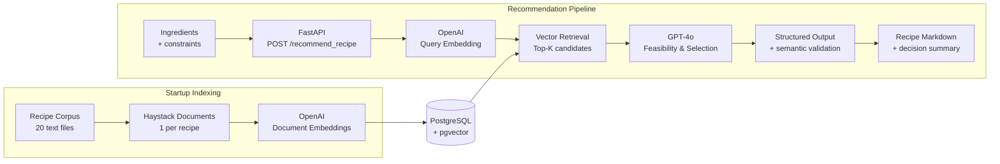

# What's for Dinner

A small RAG application that recommends one recipe from a fixed corpus based on a free-text
description of the ingredients and constraints a user has. Built with FastAPI, Haystack 2.x,
PostgreSQL/pgvector, and GPT-4o.

> Retrieval finds plausible candidate recipes; it does not make the final recommendation
> decision. GPT-4o compares the retrieved candidates against the user's actual ingredients and
> constraints and produces an explainable, structured decision.

## Contents

- [Architecture](#architecture)
- [Setup](#setup)
- [Using the API](#using-the-api)
- [How startup ingestion works](#how-startup-ingestion-works)
- [The structured recommendation decision](#the-structured-recommendation-decision)
- [Pantry-staple policy](#pantry-staple-policy)
- [Design decisions & trade-offs](#design-decisions--trade-offs)
- [Limitations](#limitations)
- [Tests](#tests)
- [Evaluation strategy](#evaluation-strategy)
- [Image input (bonus, not implemented)](#image-input-bonus-not-implemented)
- [Production evolution](#production-evolution)

## Architecture



**Retrieval generates candidates; it does not make the recommendation.** GPT-4o evaluates
ingredient coverage and user constraints across the retrieved candidates. The resulting
structured decision is then validated by the application to ensure the selected recipe actually
belongs to the retrieved candidate set.

### Project layout

```
src/whats_for_dinner/
  config.py, errors.py, models.py    settings, domain exceptions, Pydantic models
  recipes.py, ingestion.py           recipe loading + deterministic IDs, idempotent ingestion
  retrieval.py, prompts.py           pgvector retrieval, the recommendation prompt
  generation.py, service.py          GPT-4o structured output, orchestration + semantic validation
  main.py                            FastAPI app, component wiring, the one thin route
  *_test.py                          colocated pytest tests, one per module
eval/                                 manually annotated evaluation fixture + runner
```

`data/recipes/` (the 20 supplied recipes) is what the app actually reads; `data.zip` is the
original archive, unused.

Flat inside `src/whats_for_dinner/` on purpose - the corpus and pipeline are small enough that
sub-packages would add navigation overhead without benefit.

## Setup

### Prerequisites

- Python 3.12+, [`uv`](https://docs.astral.sh/uv/)
- A Docker-compatible runtime (Docker Desktop, or Colima + the `docker` CLI)
- An OpenAI API key with access to `gpt-4o` and an embedding model

### 1. Start PostgreSQL/pgvector

```bash
docker compose up -d
```

Starts the supplied `ankane/pgvector` image on `localhost:5432`. No other datastore is used.

> No named volume is configured, so `docker compose down` also wipes the database (`stop`/`start`
> preserves it). Not an issue in practice: ingestion is idempotent and cheap, so the app
> self-heals - including recreating the `vector` extension - on next startup.

### 2. Configure environment

```bash
cp .env.example .env   # then set OPENAI_API_KEY
```

| Variable | Purpose | Default |
|---|---|---|
| `OPENAI_API_KEY` | required, never logged/printed | - |
| `OPENAI_CHAT_MODEL` | generation model | `gpt-4o` |
| `OPENAI_EMBEDDING_MODEL` | embedding model | `text-embedding-3-small` |
| `EMBEDDING_DIMENSION` | must match the embedding model's output size | `1536` |
| `DATABASE_URL` | pgvector connection string | matches `docker-compose.yml` |
| `RECIPE_DATA_PATH` | folder of recipe `.txt` files | `data/recipes` |
| `RETRIEVAL_TOP_K` | candidates retrieved before GPT-4o reasoning | `5` |

### 3. Install dependencies

```bash
uv sync
```

Creates `.venv`, installs pinned dependencies plus a `dev` group. `pgvector-haystack==3.4.1` was
added explicitly - Haystack 2.12 has no Postgres integration built in (see
[Design decisions](#design-decisions--trade-offs)).

### 4. Run the app

```bash
uv run uvicorn whats_for_dinner.main:app --reload
```

Ingests recipes on startup (see below), then serves at `http://127.0.0.1:8000`.

## Using the API

```bash
curl -s -X POST http://127.0.0.1:8000/recommend_recipe \
  -H 'Content-Type: application/json' \
  -d '{"text": "I have chicken, broccoli and soy sauce"}'
```

```json
{
  "recipe": "# Quick Chicken Stir-Fry\n\n**Ingredients:**\n\n- 2 chicken breasts, diced\n...",
  "decision": {
    "selected_recipe": "Quick Chicken Stir-Fry",
    "matched_ingredients": ["chicken", "soy sauce"],
    "missing_ingredients": ["mixed vegetables", "garlic"],
    "assumed_pantry_staples": ["vegetable oil"],
    "constraint_conflicts": [],
    "is_reasonable_match": true
  }
}
```

An explicit exclusion (e.g. "no cheese, I'm dairy-free") that every candidate conflicts with
returns `is_reasonable_match: false` with the conflicting ingredient named, instead of silently
picking a conflicting recipe or inventing one outside the corpus. Empty/whitespace-only `text`
returns `422` before any retrieval or generation happens.

The public response (`RecommendResponse`) only exposes `recipe` (Markdown) and a
`DecisionSummary` (matched/missing ingredients, pantry assumptions, constraint conflicts,
`is_reasonable_match`); the full internal decision (`selected_recipe_id`, `decision_reason`) is
logged per request rather than returned, to keep the API contract simple.

## How startup ingestion works

Each recipe file becomes one `Document`, with ID `sha256(filename + normalized_content)`:

- **Idempotent** - the same file produces the same ID every run, so `ingest_recipes` only embeds
  documents not already in the store. Restarting makes zero embedding calls once indexed.
- **Self-healing on edits** - changed content changes the ID; the old version (matched by
  `meta.source`) is deleted so the store never accumulates stale duplicates.

Verified manually: two consecutive startups against the supplied 20 recipes ingest 20, then 0,
with the pgvector row count unchanged.

## The structured recommendation decision

`OpenAIChatGenerator.run` in the pinned Haystack version (`2.12.0`) has no `response_format`
parameter - that came in later releases. Structured output is requested the way the pinned
`openai==1.75.0` client supports it directly: a strict JSON-schema `response_format` passed
through `generation_kwargs`. The reply is parsed with
`RecommendationDecision.model_validate_json`, so a malformed reply fails loudly as a
`GenerationError` (verified directly against a live GPT-4o call before being wired in - see
`generation.py`'s module docstring).

```python
class RecommendationDecision(BaseModel):
    selected_recipe_id: str
    selected_recipe_title: str
    matched_ingredients: list[str]
    missing_ingredients: list[str]
    assumed_pantry_staples: list[str]
    constraint_conflicts: list[str]
    decision_reason: str
    is_reasonable_match: bool
    markdown: str
```

Structural validity (the schema above) doesn't guarantee semantic validity - the model could
still select a recipe id that was never in the retrieved candidates. `service.py` checks this
explicitly after generation and raises `GenerationError` if so, and canonicalizes
`selected_recipe_title` from the matched candidate rather than trusting the LLM's own copy of
it, so a valid-id/wrong-title reply behaves deterministically. As a similar safety net,
`generation.py` strips any ingredient the model lists in *both* `missing_ingredients` and
`assumed_pantry_staples` (observed once during manual testing).

Every request logs one structured record (`service.py`): request ID, retrieved candidate
IDs/titles/scores, the full decision, model names, and latency - without ever logging the API
key or database credentials.

## Pantry-staple policy

A small, explicit, easy-to-change list in `prompts.py`:

```python
PANTRY_STAPLES: list[str] = ["salt", "pepper", "water", "cooking oil"]
```

Common real-world names for "cooking oil" (vegetable, olive, canola) are listed explicitly in
the prompt too, so the same staple is recognized deterministically regardless of which synonym a
recipe uses - not left to the model's own judgment call. A recipe ingredient the user didn't
mention is `assumed_pantry_staples` only if it matches one of these; everything else not
mentioned is a genuine `missing_ingredient`.

## Design decisions & trade-offs

- **One document per recipe** - recipes are short cohesive units; chunking would separate
  ingredients from the instructions that use them.
- **pgvector, no other vector store** - supplied by the challenge; a second datastore would be
  unjustified for a 20-recipe PoC.
- **`pgvector-haystack` as an added dependency** - Haystack 2.12 has no Postgres integration
  built in. `3.4.1` is the newest release still declaring `haystack-ai>=2.11.0`; `6.x` requires
  `>=2.22.0` and won't install alongside the pinned version.
- **Semantic retrieval is candidate generation, not the final decision** (PIPELINE.md's central
  principle) - no hard similarity threshold without evaluation evidence; `top_k` is the only lever.
- **GPT-4o performs the final reasoning**, comparing literal user ingredients against each
  candidate's real ingredient list - vector similarity alone can't tell feasibility.
- **Semantic validation after generation** - structural (JSON-schema) validity doesn't guarantee
  the selected id was actually retrieved; checked explicitly, with the title canonicalized from
  the matched candidate rather than trusted from the LLM.
- **Structured decision over free-form Markdown** - matched/missing/pantry fields are explicit,
  not reverse-engineered from prose, so the system is debuggable and evaluable.
- **Quantities stay natural language** - the full request is preserved and passed to GPT-4o
  as-is; no unit/measurement normalization subsystem was built.
- **Startup ingestion, not a separate job** - justified by the corpus size (20 recipes); a
  dedicated indexing job is the scaling path (see Limitations/Future improvements).
- **No repository-layer wrapping around `PgvectorDocumentStore`** - it already is the storage
  abstraction. Where test isolation was needed, small `typing.Protocol` interfaces describe only
  the one or two methods each module calls - zero-runtime-cost typing, not another layer.
- **No SQLModel / custom tables** - `PgvectorDocumentStore` owns its own schema; SQLModel models
  for a table this app never queries directly would be pure ceremony.
- **Sync Haystack calls, async API boundary** - the pinned embedders have no `run_async`, so the
  pipeline is sync internally; the one blocking call per request is offloaded with
  `asyncio.to_thread` rather than forcing a partially-async pipeline.
- **Manually annotated evaluation fixture**, not the evaluated model's own output, as ground truth.

## Limitations

- The 20-recipe corpus is tiny; retrieval quality here doesn't generalize to a larger, noisier
  catalog - see [Evaluation strategy](#evaluation-strategy) for what would need to grow with it.
- Ingredient interpretation during recommendation is handled by GPT-4o, not a deterministic
  matcher - there's no ingredient-normalization or ontology layer, so whether "veggies" counts
  as "mixed vegetables" is the model's judgment call. Evaluation, separately, compares the
  model's reported ingredient lists against manually annotated labels using case-insensitive
  set matching - that comparison is deterministic even though the recommendation itself isn't.
- `missing_ingredients` recall isn't perfect (~0.5-0.6, see Evaluation strategy) - the model
  sometimes under-reports an ingredient it considers minor (e.g. cheese folded into a sauce).
- **Recipe selection is not fully deterministic** - see
  [Evaluation strategy](#evaluation-strategy) for a concrete example. A single passing run or
  manual test is not sufficient evidence of correctness.
- `custom_components.py` (the supplied image-extraction helper) has pre-existing `pyright`
  errors from the challenge's own reference code; unused, unmodified.
- No auth, rate limiting, or production observability - out of scope for a PoC.

## Tests

```bash
uv run pytest       # 30 tests, all OpenAI/DB calls replaced with small fakes, <1s
uv run ruff check .
uv run pyright
```

Colocated as `<module>_test.py` next to the module they test (`recipes_test.py`,
`ingestion_test.py`, `generation_test.py`, `service_test.py`, `main_test.py`), per
CONVENTIONS.md. Coverage: recipe loading/deterministic IDs, ingestion idempotency, structured
generation parsing + schema request + error mapping, service orchestration + semantic validation
(hallucinated-id rejection, title canonicalization), and the public API contract including 502s
that don't leak the underlying exception text. `eval/run_eval_test.py` covers the evaluator's own
logic the same way - it exercises `validate_selection` (imported from `service.py`, not
duplicated) with fakes, so evaluation is checked against the identical semantic-validation
invariant production enforces.

`pyright`'s `typeCheckingMode` is `"basic"`, not `"strict"` - tried deliberately: after fixing
every legitimate issue strict mode found, 33 errors remained, all either `haystack-ai` having no
type stubs at all (fires in every file that imports it) or inside the unused
`custom_components.py` stub. See the comment in `pyproject.toml` for the full reasoning.

## Evaluation strategy

Retrieval and generation are evaluated independently, against a small **manually annotated**
fixture (`eval/dataset.jsonl`, 10 queries) - annotated and reviewed by the developer of this
project, not an independent multi-annotator study. Never evaluated against the model's own
output as ground truth. Run it (costs real OpenAI calls, run sparingly):

```bash
uv run python eval/run_eval.py
```

Each run prints the report and overwrites `eval/results.json` (not committed - GPT-4o's output
isn't fully deterministic) with the same numbers as structured data, so one run can be compared
against a later one after a prompt/model change.

**Retrieval metrics**: Recall@K, Precision@K, Hit rate@K, MRR - "did retrieval hand generation
the right recipe at all?" **Generation metrics**: selection accuracy, `is_reasonable_match`
accuracy, constraint-conflict precision/recall (the actual conflicting items, not just whether
*some* conflict was reported), and matched/missing ingredient precision/recall.

**Failure taxonomy** per query, in priority order: `retrieval failure` -> `selection failure`
-> `constraint failure` -> `ingredient-accounting failure` -> `pass` - lets an engineer localize
*which stage* regressed instead of reading one aggregate score.

### Actual run (live GPT-4o + the supplied corpus)

```
Recall@5 1.00  Precision@5 0.24  Hit rate@5 1.00  MRR 1.00
Selection accuracy 1.00  is_reasonable_match accuracy 1.00
Constraint conflicts P/R 0.90/0.90   Matched P/R 0.92/0.92   Missing P/R 0.62/0.67
```

Retrieval was perfect on this fixture (expected - 20 well-separated recipes, top_k=5; not
evidence of production-scale quality given the corpus/fixture size). 8 of 10 queries passed
outright. The one constraint-conflict "failure" is a useful finding about the *metric*, not the
system: for the no-cheese Caprese Chicken query, GPT-4o correctly rejected the recipe
(`is_reasonable_match: false`) but phrased the conflict as `"contains cheese"` rather than the
annotated `"cheese"` - exact-set string matching scores that as wrong even though the underlying
decision was right. The other two failures are the already-known `missing_ingredients` recall
weakness (the model under-reporting an ingredient it considers minor).

**Historical finding, kept because it's hard to reproduce on demand:** an earlier pair of
consecutive runs (before the constraint-conflict precision/recall metric above existed) showed
GPT-4o's *recipe selection itself* changing between identical runs - selection accuracy moved
from 1.00 to 0.80, including one run where **Stuffed Bell Peppers** (no chicken, contains the
excluded cheese) was picked over the clearly better **Caprese Chicken** for that same query. That
remains the core limitation this evaluation setup exists to catch: **GPT-4o's output is not fully
deterministic**, a single run (this one included) is not sufficient evidence of quality, and a
larger fixture run multiple times per change would be needed before trusting a metric movement as
real.

## Image input (bonus, not implemented)

Not implemented - time went into ingestion robustness, semantic validation, tests, and the
evaluation fixture instead. If added (PIPELINE.md section 25), it's a pure input adapter, not a
second architecture: extend `custom_components.py`'s `ExtractFoodItemsFromImage` to extract
ingredients from an image (preserving uncertainty rather than inventing unseen ones), concatenate
that with any user text, and hand the combined text to the existing
`RecommendationService.recommend(...)` unchanged. The request model would gain an optional image
field; the route would run vision extraction first when present.

## Production evolution

Nothing below is built - this is a PoC, deliberately. It documents how the existing,
already-separated architecture could evolve if this went to production, not a plan to build it
here.

| Area | Current | At production scale |
|---|---|---|
| **Maintainability** | Small single-purpose modules, typed `Protocol` boundaries, Pydantic contracts, colocated unit tests, explicit structured LLM output | CI quality gates for `pytest`/`ruff`/`pyright`; integration/contract tests around PostgreSQL and the model boundaries; versioned prompt/model configuration; a growing regression evaluation fixture as real failures are discovered |
| **Extensibility** | Retrieval, generation, and the API are already separate concerns, so extensions can slot in without replacing the business flow | Image ingredient extraction as an input adapter; alternative retrieval/reranking strategies; alternative model implementations behind the existing `Protocol` interfaces - none of this is implemented today |
| **Scalability** | Startup ingestion, one document per recipe, pgvector top-k retrieval, full-store checks (fine at 20 rows) | Dedicated/offline ingestion job; batched embeddings; proper pgvector indexes; metadata/ingredient filtering; retrieve a wider candidate set and cheaply rerank it down before GPT-4o; horizontally scale the stateless API if traffic requires it - no Redis/Kafka/Kubernetes without a demonstrated need |

**Observability and failure diagnosis.** Every successful request already logs (`service.py`):
request ID, retrieved candidate IDs/titles/scores, the selected recipe, matched/missing
ingredients, pantry assumptions, constraint conflicts, model identifiers, and latency. Failures
log request ID, request length, error type, and latency. In production these same structured
fields would feed centralized logs/traces and metrics - request/error rate and latency, retrieval
latency/quality, LLM latency and token/cost usage, malformed or semantically invalid model
responses, and recommendation-quality regressions over time. **Online observability answers "is
the system healthy, and where did this request fail?"; offline evaluation (above) answers "is
retrieval/recommendation quality still good?"** - deliberately different signals, not a
substitute for one another. Logging request content in production would need an explicit
privacy/retention policy first.
